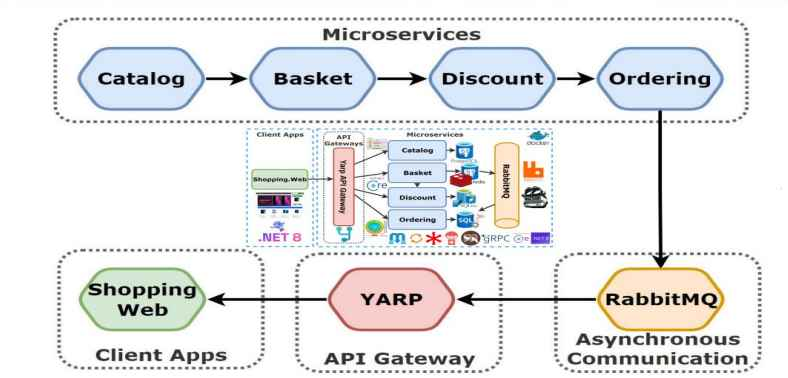

# YARP API Gateway

This project implements a high-performance API Gateway using [YARP (Yet Another Reverse Proxy)](https://microsoft.github.io/reverse-proxy/), a library from Microsoft that provides a modern reverse proxy implementation for .NET applications.

## Overview

The YARP API Gateway serves as the single entry point for all client applications, routing requests to the appropriate microservices:

- Catalog
- Basket
- Discount (HTTP & gRPC)
- Ordering

## Architecture



## Features

- **Request Routing**: Intelligent routing based on URL patterns
- **Load Balancing**: Distribution of traffic across service instances
- **Health Monitoring**: Real-time health checks of all services
- **Rate Limiting**: Protection against excessive traffic
- **Correlation IDs**: End-to-end request tracking
- **Structured Logging**: Comprehensive logging with Serilog

## API Routes

| Client Request | Routed To | Description |
|----------------|-----------|-------------|
| `/api/catalog/**` | Catalog Service | Product catalog operations |
| `/api/basket/**` | Basket Service | Shopping cart operations |
| `/api/discount/**` | Discount Service (HTTP) | Discount management |
| `/grpc/discount/**` | Discount Service (gRPC) | gRPC discount operations |
| `/api/ordering/**` | Ordering Service | Order management |

## Health Checks

The gateway provides health check endpoints for monitoring system status:

- `/health` - Overall gateway health
- `/health/catalog` - Catalog service health
- `/health/basket` - Basket service health  
- `/health/discount` - Discount HTTP service health
- `/health/discount-grpc` - Discount gRPC service health
- `/health/ordering` - Ordering service health

### Health Dashboard

A visual dashboard for service health is available at `/health-ui`

## Running the Gateway

### Development Environment

```powershell
cd src/YarpGateway
dotnet run
```

The gateway will be available at http://localhost:5000

### Docker

```powershell
docker-compose up -d
```

The gateway will be available at http://localhost:8000

## Configuration

Service endpoints and routing rules can be configured in:
- `appsettings.json` - Production settings
- `appsettings.Development.json` - Development settings

## Service Dependencies

The API Gateway expects the following services to be running:

1. **Catalog Service** - Product catalog management
   - Default URL: `http://catalog-api:80` (Docker)
   - Development URL: `http://localhost:5001`

2. **Basket Service** - Shopping cart operations
   - Default URL: `http://basket-api:80` (Docker)
   - Development URL: `http://localhost:5002`

3. **Discount Service (HTTP)** - Discount management
   - Default URL: `http://discount-api:80` (Docker)
   - Development URL: `http://localhost:5003`

4. **Discount Service (gRPC)** - gRPC discount operations
   - Default URL: `http://discount-api:81` (Docker)
   - Development URL: `http://localhost:5103`

5. **Ordering Service** - Order processing
   - Default URL: `http://ordering-api:80` (Docker) 
   - Development URL: `http://localhost:5004`

## Technical Details

- Built with .NET 8 and ASP.NET Core
- Used YARP 2.1.0 for reverse proxy functionality
- Integrated health monitoring with AspNetCore.HealthChecks
- Logging with Serilog
